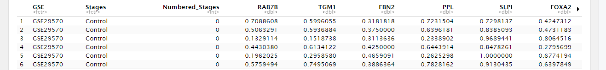
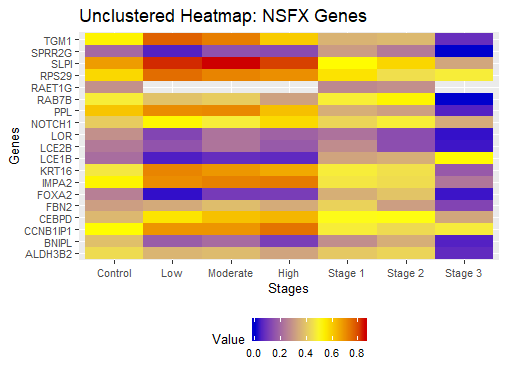
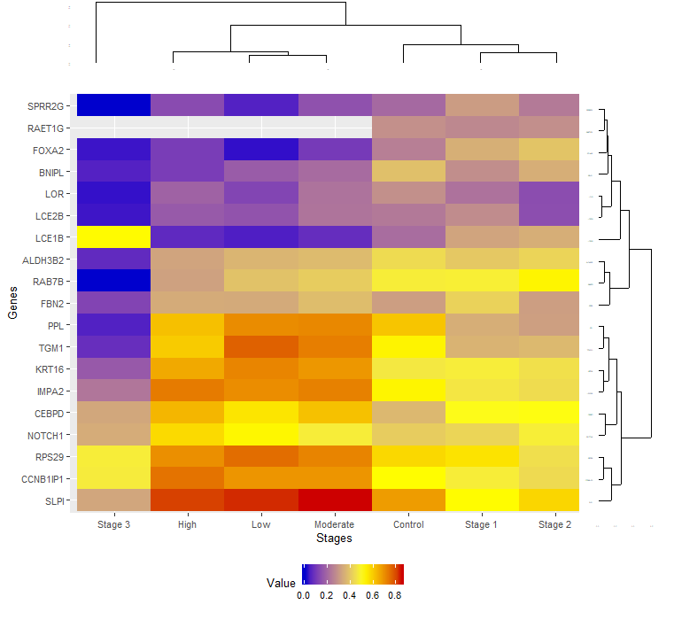
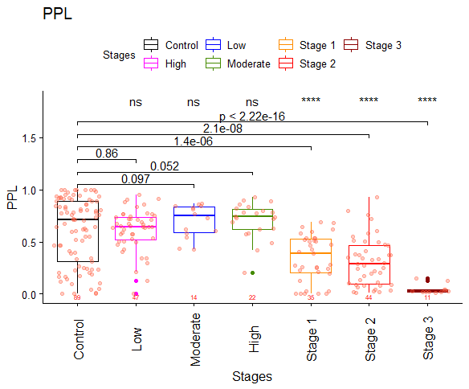
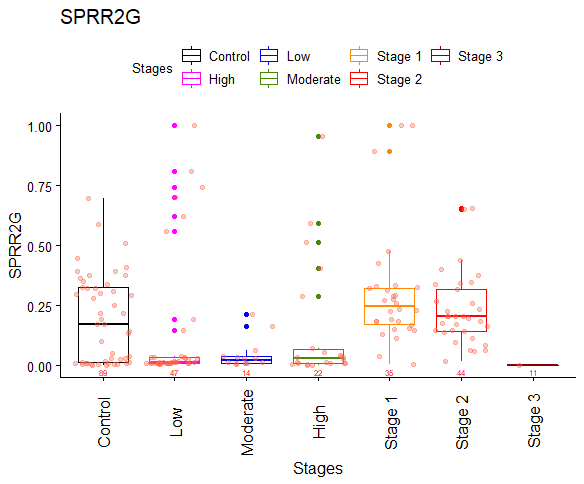
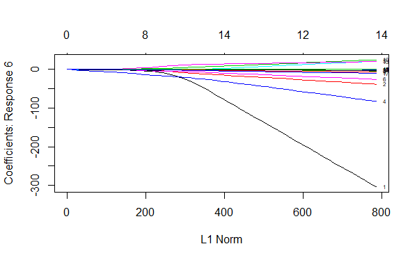
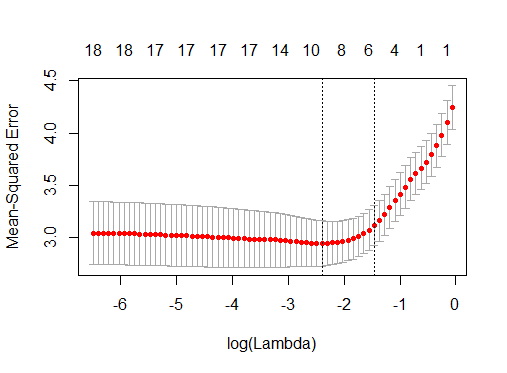
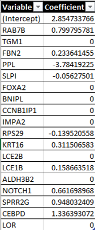

I was not able to render my R notebook on here like one would be able to with a Juypter Notebook. This means I had to make it a markdown file to include my output. 

Also, the dataset here is the reduced one. It is 262 rows by 22 columns. The original is 313x25200. 

The end results are at the bottom. Please feel free to send me a message if you need ana explanation as to what the Lambda charts mean. Also, the end formula is in the form y = b_0 + b_1(x_1) + b_2(x_2) + .... + b_n(x_n)...In very general terms.
# Let's take a look at the data
```{r}
#Just reading in the data 
NSFX = read.csv("C:/Users/Isaiah1/Documents/Research/WallaceLab/NSFX_DataSets/thedat.csv")
head(NSFX)
dim(NSFX)
```

```

# We need to clean up the data in order to construct some heatmaps  

# Let's start out by cleaning it up
```{r}
#Take out the Gene Symbol, GSE, and Numeric Staging
NSFX_1 = NSFX[,-c(1,3)]

#Setting up a df of stages
stages = (NSFX_1[,1])

#This will now be a matrix of numeric values only
NSFX_1 = t(NSFX_1[,-1])

#Set the columns to the stages. Columns are stages and rows are genes
colnames(NSFX_1) = stages

#What we did was transform the row id's to the correct/corresponding stages
x = as.matrix(t(NSFX_1))

#Transform the stage variable to a factor variable 
stages = as.factor(stages)

#This method that is commented out will let you change the factor levels with maipulation of the numeric vector c()
stages = factor(stages, levels(stages)[c(1,3,4,2,5,6,7)])
list_stages = list(stages)
```  
  
## Aggregating the data
```{r}
#We will group the data by stage
heat = aggregate(x, by=list_stages, FUN = mean, na.rm=TRUE)

#transposing the aggregated data
heat2 = t(heat)
#giving the columns stage names 
colnames(heat2) = heat2[1,]

#getting rid of the extra row
heat2 = heat2[-1,]
#change the heat2 to numeric
mode(heat2) = 'numeric'
```
  
```{r include=FALSE}
#Libraries
library(glmnet)
library(pheatmap)
library(tidyverse)
library(dplyr)
library(ggplot2)
library(ggdendro)
library(reshape2)
library(grid)
library(gplots)
library(edgeR)
library(RColorBrewer)
library(cowplot)
library(ggpubr)
library(ggpmisc) 

#Set a seed
set.seed(747)

#Formatiting a blank heatmap 
eaxis<-list(
  showticklabels=FALSE,
  showgrid=FALSE,
  zeroline=FALSE
)
```
  
## Further data preperation 
```{r include=FALSE}
gene.matrix = heat2
stage.matrix = t(heat2)


#We need to make heat00 a data.frame that looks like heat2
#for melt() we use later. The only difference is we have the
#rownames as an actual variable in the data.frame
genes2<-rownames(heat2)
genes2<-as.data.frame(genes2)
heat00<-cbind(genes2,heat2)
heat00<-as.data.frame(heat00)
attach(heat00)

#First make heat2 a data.frame so we can melt it down. Give it a long format which melt will do
#Melting the data into long format is necessary to create a heatmap
heat.long<-melt(heat00, id.vars="genes2")

#This commented out line of code is just rearranging the variales
#heat.long$variable = factor(heat.long$variable, levels(heat.long$variable)[c(1,3,4,2,5,6,7)])

#Taking out missing values
heat.long<-na.omit(heat.long)

```
  
## Actual Heatmap construction (unclustered).
```{r}
#Plotting the unclustered heatmap - no dendograms no order
unclustered = ggplot(heat.long, aes(x=variable, y=genes2)) +
  geom_tile(aes(fill=value)) + xlab("Stages") + ylab("Genes") +
  scale_fill_gradientn(colours=c("blue3","yellow","red3"),
                       values=c(0.0, 0.6, 1.0),
                       guide="colorbar")+
  theme(axis.text.y = element_text(size=8), axis.text.x = element_text(size=8), 
        axis.title.x=element_text(size=10), axis.title.y=element_text(size=10), legend.position='bottom', 
        legend.direction = 'horizontal', legend.text=element_text(size=8), legend.title=element_text(size=10))+
  labs(x="Stages", fill="Value") + ggtitle("Unclustered Heatmap: NSFX Genes")
print(unclustered)
```
  
  
## Construction of the dendograms; required for clustering.  
```{r}
#Gene Dendogram
heat.dendro<-as.dendrogram(hclust(d=dist(x=gene.matrix)))
dendro.plot1<-ggdendrogram(data=heat.dendro, rotate=TRUE)
dendro.plot1<-dendro.plot1 + theme(axis.text.y = element_text(size = 0), axis.text.x=element_text(size=0))
plot(dendro.plot1, xlab=eaxis, ylab=eaxis)

#Stage Dendogram
heat.dendro2<-as.dendrogram(hclust(d=dist(x=stage.matrix)))
dendro.plot2<-ggdendrogram(data=heat.dendro2, rotate=FALSE, labels=FALSE)
dendro.plot2<-dendro.plot2 + theme(axis.text.y = element_text(size = 0), axis.text.x = element_text(size=0))
plot(dendro.plot2, xlab=eaxis, ylab=eaxis)

#Ordering the dendograms 
heat.order<-order.dendrogram(heat.dendro)
heat.order2<-order.dendrogram(heat.dendro2)
heat.long$genes<-factor(x=heat.long$genes, levels=rownames(heat00)[heat.order], ordered=TRUE)
heat.long$variable<-factor(x=heat.long$variable, levels=colnames(heat00[,-1])[heat.order2], ordered=TRUE)
heat.long<-na.omit(heat.long)
```
  
## Construction of the clustered gene/stage heatmaps.  
```{r}
#plot heat map
Clustered<-ggplot(data=heat.long, aes(x=variable, y=genes)) + xlab("Stages") + ylab("Genes") + 
  geom_tile(aes(fill=value)) +
  scale_fill_gradientn(colours=c("blue3","yellow","red3"),
                       values=c(0.0, 0.6, 1.0),
                       guide="colorbar")+
  theme(axis.text.y = element_text(size=8), axis.text.x = element_text(size=8), 
        axis.title.x=element_text(size=10), axis.title.y=element_text(size=10), legend.position='bottom', 
        legend.direction = 'horizontal', legend.text=element_text(size=8), legend.title=element_text(size=10))+
  labs(x="Stages", fill="Value")
print(Clustered)
```


## Let's take a look at just the heatmap of clustered genes and not stages
```{r}
#Gene Dendogram
heat.dendro<-as.dendrogram(hclust(d=dist(x=gene.matrix)))
dendro.plot1<-ggdendrogram(data=heat.dendro, rotate=TRUE)
dendro.plot1<-dendro.plot1 + theme(axis.text.y = element_text(size = 0), axis.text.x=element_text(size=0))
#plot(dendro.plot1, xlab=eaxis, ylab=eaxis)


#Ordering the dendograms 
heat.order<-order.dendrogram(heat.dendro)
heat.long$genes<-factor(x=heat.long$genes, levels=rownames(heat00)[heat.order], ordered=TRUE)
heat.long$variable<-factor(x=heat.long$variable, levels=colnames(heat00[,-1]), ordered=TRUE)
heat.long<-na.omit(heat.long)

#plot heat map
Clustered<-ggplot(data=heat.long, aes(x=variable, y=genes)) + xlab("Stages") + ylab("Genes") + 
  geom_tile(aes(fill=value)) +
  scale_fill_gradientn(colours=c("blue3","yellow","red3"),
                       values=c(0.0, 0.6, 1.0),
                       guide="colorbar")+
  theme(axis.text.y = element_text(size=8), axis.text.x = element_text(size=8), 
        axis.title.x=element_text(size=10), axis.title.y=element_text(size=10), legend.position='bottom', 
        legend.direction = 'horizontal', legend.text=element_text(size=8), legend.title=element_text(size=10))+
  labs(x="Stages", fill="Value")
print(Clustered)
```


## Boxplot pictures  
I just chose two of the boxplots out of the twenty-two I. These are representatives for patterens that we see in other genes  
  
### This is the PPL Gene
Notice how when it goes from Control to Stage 3 we see a descending pattern/

### This is the SPRG2 Gene
In this one we notice 'blips' in different stages


# It is finally time for the LASSO portion of the project
```{r}
#load the data 
mydf = NSFX

#dropping RAETG1 because it has so many missing values 
mydf = mydf[,-15]

#attach will let us call objects with less key strokes
attach(mydf)

#set the numeric staging information as a matrix named y0
y0=mydf[,3]
y0=as.matrix(y0)

#X0 should only carry data values
x0=mydf[,-c(1:3)]
x0=as.matrix(x0)


#Set any N/A value to 0
x0[is.na(x0)]=0

#let n be the number of rows in cevical cancer data set
n=dim(mydf)[1]
genes=colnames(mydf)[-c(1:3)]
rep=100


#let ngenes be the number of columns in x0
ngenes=dim(x0)[2]

#create matrix of zeros of size; n rows and ngenes columns
model=matrix(0,n,ngenes)
#model=matrix(0,rep,ngenes)

#set column names to genes 
colnames(model)=genes
```

```{r}
for (i in 1:50) {
  #take sample of size n
  index=sample(n)
  #let part be the index of size 1 to 240
  part=index[1:240]
  #let y be y0 of part significant values
  y=y0[part]
  #while loop through table y, as a vector, and count values <8.
  while(min(as.vector(table(y)))<8){
    index=sample(n)
    part=index[1:240]
    y=y0[part]
  }
  #let x be siginficant rows in x0
  x=x0[part,]
  #let is.nan.data.frame be a function of y and apply do.call to list arguments column bind and apply a list of y 
  #and values that are nan
  is.nan.data.frame<-function(y){
    do.call(cbind, lapply(y, is.nan))
  }
  #Set all nan values in x be 0
  x[is.nan(x)]=0
  #apply glmnet to the input matrix x using response variable y following the multinomial distribution with
  #alpha=1 (for lasso regression) with n lambda values -- default nlambda value = 100
  lasso.fit <- glmnet(x,y,family="multinomial",alpha=1,nlambda=100)
  #let beta be the extracted lambda coefficients returned from the modeling function (glmnet)
  beta=coef(lasso.fit, s=0)
  #bind each beta of column 0 through column 8 each as its own vector
  coef=cbind(as.vector(beta$`0`),as.vector(beta$`1`),as.vector(beta$`2`),as.vector(beta$`3`),as.vector(beta$`4`),
             as.vector(beta$`5`),as.vector(beta$`6`),as.vector(beta$`7`))
  #remove first row of coefficients:
  coef=coef[-1,]
  #let l2norm be the square root of the sums reach row of squared coefficient
  l2norm=sqrt(rowSums(coef^2))
  #let order be the rank of l2norm
  order=rank(l2norm)
  #order by being either greater than or less than value ngenes/2; 
  #let those less than ngenes/2 be 0 (failure)
  #let those greater than ngenes/2 be 1 (success)
  #Number of genes is even -- this doesnt correspond well with test (line below)
  order[order<=ngenes/2]=0
  order[order>ngenes/2]=1
  #let each value of model be the respective value calaculated from ordering
  model[i,]=order
}

plot(lasso.fit, label=TRUE)
```

```{r}
#let CCResult be the sum of each column in model
NSFXResult=colSums(model)
NSFXResult
```

```{r}
#To cross-validate, use cv.glmnet and plot cv_fit
cv_fit<-cv.glmnet(x,y,alpha=1,nlambda=100)
plot(cv_fit)
#let the optimum lambda be cv_fit of the minimum lambda value
opt_lambda<-cv_fit$lambda.min
opt_lambda
```

```{r}
#To calculate leading coefficients of model equation
coefsMin<-coef(cv_fit, s="lambda.min")
ceofsMin<-as.matrix(coefsMin)
g<-as.data.frame(ceofsMin)
g
```



