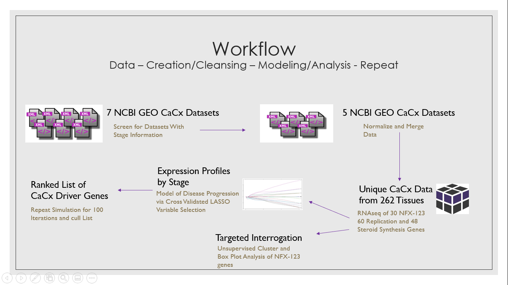

# Stage Dependent Modeling of Cervical Cancer from Gene Expression Data (Machine Learning on Biological Data using R)

## How this README is organized (just scroll to the bottom if you're only looking for code)
1. Project Description
2. Project Inspiration 
3. A little bit about LASSO
4. The Workflow of the project
5. Data, Boxplots, and Heatmaps
6. Code and a little about it.  

## Project Description:
I'm being funded to help the [Wallace Lab](https://wallacelabksu.weebly.com/) at Kansas State University. Specifically, I'm applying [LASSO](https://www.jstor.org/stable/2346178?seq=1), which is an efficient machine learning model used for feature selection and regularization. I also did boxplot analysis of the genes, and then I made a heatmap of the data by using complete linkage

## Project Inspiration
Prophylactic vaccines can prevent the human papillomavirus (HPV) infections that cause cervical cancers (CaCx). Yet, CaCx still kills a woman every 90 seconds. Vaccine hesitancy hinders the herd immunity and broad protection in wealthy countries. Some of the hesitancy comes from the very low rates of CaCx thanks to widespread frequent pap smear screening that are quite effective at providing early interventions that prevent these malignancies. Indeed, the 14 million new HPV infections each year in the US, only result in 13,170 cases of CaCx. In developing countries, where the majority of CaCx deaths occur, fiscal and infrastructural constraints further any hope for a successful vaccination campaign and present significant barriers to pap smear screening. 
While these screening modalities are quite effective at detecting pre-malignant lesions, they could be done less frequently if we could identify women who are at higher risk of progression. Most HPV infections and many premalignant lesions would be cleared by the host immune response without ever posing a cancer risk. However, since there are no established biomarkers for triaging women based on the relative likelihood of progression, paps smears have become routine.  If women at greater risk could be identified, paps smear screening could be optimized by less frequent screening of low risk cohorts. In higher socioeconomic groups, this would decrease the stress and physical discomfort associated with the exam. The potential rewards in low and middle-income nations would be far greater. In these communities, reducing the number of interventions would allow limited resources to be better allocated to people with the greatest need.

### LASSO
I'm using Multinomial LASSO which is found in the GLMNET package description [here](https://web.stanford.edu/~hastie/glmnet/glmnet_alpha.html). It is specifically under the Multinomial Models section of the webpage. 

### Why LASSO?
LASSO is great for parsimonious modeling when dealing with high-dimesional n<<p datasets because of the shrinkage it conducts (feature selection). This helps us deal with overfitting. 

## Workflow
I've been working on this project for almost 6 months now. I have to check in with my research team every week to show them what I'm working on since I am being funded. This also helps me a great deal because they let me know whether my analysis makes sense, because I don't know too much about the biology happeneing. __I'm just the computer/stats guy in this research team, which is an honor in itself.__

This project started off with gathering the data needed to conduct any analysis. We screened and filtered through hundreds of thousands of observations coming from __7 different NCBI GEO Cervical Cancer Databases.__ 

After that, the team had an ample supply of data to conduct analysis but we also had to __clean the data__, and by we I mean me. First, we normalized and merged all the data. Since not all of the observation measurments were derived the same way. Then I went through the entire dataset and let my mentors know if I seen anything weird/concerning: Lot's of NA's, 0's, Duplicates, etc. 

Finally, we had the dataset we wanted to work with. I made some heatmaps, boxplots, and applied LASSO to the dataset. Most of the time was spent getting my data ready vs actually doing machine learning or analysis. 

### Some things to note
- My team continually gives me new data to play with, the data presented here is just a portion of what I am working with. 

- This is an ongoing project and I'm hoping to figure out how to automate this before I graduate so my team can hand it off to the next stats guy they see fit to work with. 

- Please message me if you have any suggestions, criticisms, questions, etc. I'm always open for discussion

### The Code and Data 
In this repository you'll find 3 different pieces of code. 
- Heatmap Script - I used a few plotting package
- Boxplot Script - The boxplots were all done on ggplot. I'm trying to figure how to automate this (not always possible with messy data)
- LASSO Script - This is my attemp (still a work in progress) to conduct variable selection and create a prediction model for the group I'm currently working for 
