# "Dimensionality Reduction via LASSO in Cervical Cancer RNAseq Data"
# By Isaiah Solorzano


```{r  eval=FALSE}
#load packages & set seed
library(glmnet)
library(impute)
library(caret)
library(ggplot2)
library(tidyverse)
```

# Data Preperation
```{r  eval=FALSE}
#Load the data
dat = read.csv("C:/Users/16204/Documents/Classes/CIS732/Project_CIS732/raw_dat.csv", header = T)
dat
```
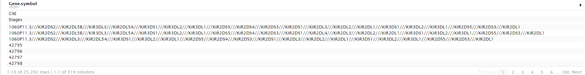  

The data is pretty messy. So, I'll have to clean it up a bit. First, I'm going to check if the data has any missing values in the "gene_name" column. If it does we'll have to take those out because they won't be suitable for analysis. So, it looks like we have one missing value in the gene name column. Let's go ahead and take it out. 

```{r  eval=FALSE}
#Check where the missing values are
miss_val = which(is.na(dat[,1]))
dat = dat[-(miss_val),]
```

I'll go ahead and make that first column the row names. These are gene names. You can see that the dataset is looking a little better here.
```{r  eval=FALSE}
#Make the first row the row names
row.names(dat) = dat[,1]

#Take out the row names and GSE
dat = dat[-c(1),-c(1)]
dat
```
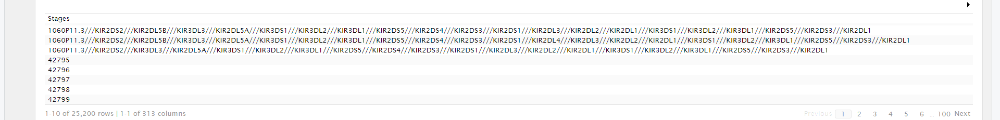  
I'll do a little regex magic to make the column gene names shorter and get rid of all the extra aliases that genes have. 
```{r  eval=FALSE}
#Transpose the dataframe
dat = t(dat)

#Fix the colnames - there were a bunch of them with different gene alieses
colnames(dat) = gsub("//.*","",colnames(dat))

#Taking that numbering of the stages out
dat = dat[,-2]

as.data.frame(head(dat[,1:20]))
```
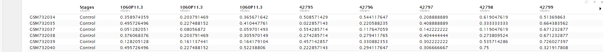  
Awesome, the data set is looking pretty clean if you ask me. I think the we still have a few things left to do here. I'm gonna check out the missing values and remove gene measurements that have too many NA's. 
```{r  eval=FALSE}
#Check out all the missing values - Here I'm going to take out features that have more than 95 values missing - 95 is roughly 30%
head(colSums(is.na(dat)))
```
  
This is just the first 5 columns. We can rest assured that there are missing values in many of the other thousands of columns.

Let's remove columns that have more than 31% of the values as missing. You'll see that the first 3 genes out because they have a bunch of missing data. 
```{r  eval=FALSE}
#Before we remove the rows with more than 31% NA's - we'll check the dimesions of the dataset
dim(dat)

#Remove columns with more than 31% missing values - This might introduce some bias - Something to note 
dat = dat[, -(which(colMeans(is.na(dat)) > .31))]

head(colSums(is.na(dat)))
```
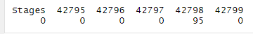  
Okay. So, now I'm going change the matrix into a dataframe to make a couple plots. I'm also going to change the numbers in the dataframe to numeric values from factor values.
```{r  eval=FALSE}
#Change the matrix into a dataframe for plotting reasons
dat = as.data.frame(dat)

#change the other rows into numeric
dat[,2:18672] = apply(dat[,2:18672], 2, function(x) as.numeric(as.character(x)))

dat
```
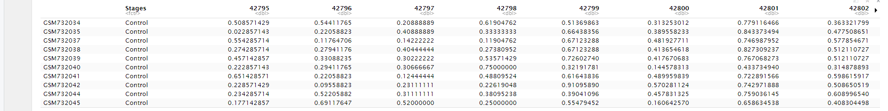  

Awesome! This dataset is looking super clean. I'm going to check if there is any duplicated columns and remove the second one.
```{r  eval=FALSE}
#There seems to be some duplicated rows
duplicated_col_ids = which(duplicated(colnames(dat)))
duple_dat = dat[,duplicated_col_ids]

#Removing the last duplicate for each duplication - I don't really know too much as to why there would be duplicate readings 
dat <- dat[, !duplicated(colnames(dat))]
```


## Distribution of Response Classes  

Let's take a look at the distribution of cancer stages avaliable to use for classification in the dataset.
```{r  eval=FALSE}
#Change level of Stages
levels(dat$Stages) = c("Control", "Low", "Moderate", "High", "Stage 1", "Stage 2", "Stage 3", "Stage 4", "Cancer")

#For the plot
stage_dat = as.data.frame(dat$Stages)
colnames(stage_dat)[1] = "Stages"

#plot the distr of classes 
ggplot(dat, aes(Stages, ..count..)) + geom_bar(aes(fill=Stages), position = "dodge") + stat_count(aes(label=..count..), vjust=0, geom="text", position="identity")  + ggtitle("Class Distribution of Data")
```
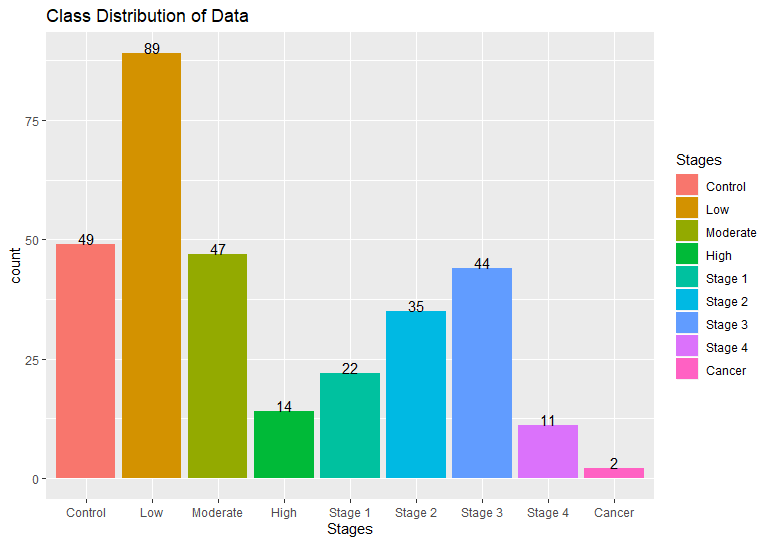  

Alright, so since I plan on using k-fold cross validation then the last two stages aren't going to let me do that because there's just not enough observations. I'll go ahead and get rid of those observations. Save the file as a csv!
```{r  eval=FALSE}
#Reorder the df
dat = dat[order(dat$Stages),]

#writing csv with all classes
#write.csv(dat, file = "processed_dat_all.csv")

#Taking cancer and Stage 4 - Might take High out as well if warnings rise
dat = head(dat, -13)

#plot the distr of classes 
ggplot(dat, aes(Stages, ..count..)) + geom_bar(aes(fill=Stages), position = "dodge") + stat_count(aes(label=..count..), vjust=0, geom="text", position="identity")  + ggtitle("Class Distribution of Data - No Cancer or Stage 4") 

#write a csv file for the dataset minus the two last classes
#write.csv(dat, file = "processed_dat_minus.csv")
```


# Imputation and Data Splitting
I'm going to impute for missing values using k-nn imputation method (k=1,2,3) and create a testing and training set for each of the imputed datasets.  
```{r  eval=FALSE}
#Load the data
gene_dat = read.csv("C:/Users/16204/Documents/Classes/CIS732/Project_CIS732/processed_data/minus_classes/processed_dat_minus.csv", header = T, row.names = 1)

gene_dat
```
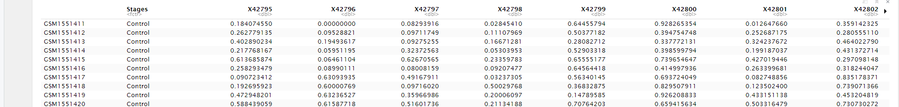

Splitting the data up into a training and testing set.
```{r  eval=FALSE}
######################################
# Splitting into Train and Test Data #
######################################
## 75% of the sample size
smp_size = floor(0.65 * nrow(gene_dat))

## set the seed to make your partition reproducible
train_ind = sample(seq_len(nrow(gene_dat)), size = smp_size)

#Test and training data
train = gene_dat[train_ind, ]
test = gene_dat[-train_ind, ]

#Check out distr again - clear plots to run this one
ggplot(train, aes(Stages, ..count..)) + geom_bar(aes(fill=Stages), position = "dodge") + stat_count(aes(label=..count..), vjust=0, geom="text", position="identity") + ggtitle("Class Distribution of Training Data") 
```


Now, I'll seperate the data from responses Y column vector to the X observation matrix.
```{r  eval=FALSE}

##Training data
X0_train = as.matrix(train[,-c(1)])
class(X0_train) = "numeric"
y0_train = as.matrix(as.factor(train$Stages))
y0_test = as.matrix(as.factor(test$Stages))
```

## Imputation
```{r  eval=FALSE}
###############################
# Imputation training dataset # - Here we will use knn imputation. I'll try a dataset with 1nn 2nn and 3nn
###############################

#impute.knn takes an expression matrix with genes as the rows and samples as columns
# set.seed should be same as beginning

#1nn imputated dataset
gene_dat_1nn_train = impute.knn(t(X0_train), k = 1, rng.seed = 747)
gene_dat_1nn_train = gene_dat_1nn_train$data
gene_dat_1nn_train = t(gene_dat_1nn_train)

#2nn imputated dataset
gene_dat_2nn_train = impute.knn(t(X0_train), k =2, rng.seed = 747)
gene_dat_2nn_train = gene_dat_2nn_train$data
gene_dat_2nn_train = t(gene_dat_2nn_train)

#3nn dataset
gene_dat_3nn_train = impute.knn(t(X0_train), k =3, rng.seed = 747)
gene_dat_3nn_train = gene_dat_3nn_train$data
gene_dat_3nn_train = t(gene_dat_3nn_train)


###########################
# Imputation test dataset # - Here we will use knn imputation. I'll try a dataset with 1nn 2nn and 3nn
###########################

#impute.knn takes an expression matrix with genes as the rows and samples as columns
# set.seed should be same as beginning

#We'll just use all the data to get these missing values imputed. The most important thing is that we don't contaminate the training data with the testing data. Other way around is cool 
X0_imp = as.matrix(gene_dat[,-c(1)])
class(X0_imp) = "numeric"

#1nn imputated dataset
gene_dat_1nn_test = impute.knn(t(X0_imp), k = 1, rng.seed = 747)
gene_dat_1nn_test = gene_dat_1nn_test$data
gene_dat_1nn_test = t(gene_dat_1nn_test)
gene_dat_1nn_test = gene_dat_1nn_test[-train_ind, ]

#2nn imputated dataset
gene_dat_2nn_test = impute.knn(t(X0_imp), k =2, rng.seed = 747)
gene_dat_2nn_test = gene_dat_2nn_test$data
gene_dat_2nn_test = t(gene_dat_2nn_test)
gene_dat_2nn_test = gene_dat_2nn_test[-train_ind, ]

#3nn dataset
gene_dat_3nn_test = impute.knn(t(X0_imp), k =3, rng.seed = 747)
gene_dat_3nn_test = gene_dat_3nn_test$data
gene_dat_3nn_test = t(gene_dat_3nn_test)
gene_dat_3nn_test = gene_dat_3nn_test[-train_ind, ]

y0_test = as.matrix(as.factor(y0_test))

#Change the response vectors to factors
y0_train = as.factor(y0_train)
y0_test = as.factor(y0_test)

#############
# CSV Files #
#############

#write.csv(gene_dat_1nn_test, file = "1nn_imputation_test.csv")
#write.csv(gene_dat_2nn_test, file = "2nn_imputation_test.csv")
#write.csv(gene_dat_3nn_test, file = "3nn_imputation_test.csv")

#write.csv(gene_dat_1nn_train, file = "1nn_imputation_train.csv")
#write.csv(gene_dat_2nn_train, file = "2nn_imputation_train.csv")
#write.csv(gene_dat_3nn_train, file = "3nn_imputation_train.csv")

#write.csv(as.data.frame(y0_train), file = "response_train.csv")
#write.csv(as.data.frame(y0_test), file = "response_test.csv")
```

# LASSO Analysis  
  
The 1nn imputed data worked best for both the LASSO model and Elastic Net model. I'll leave the analysis out of the other 2 just to save the reader the extra chunks of code.
```{r eval=FALSE}
#1nn imputed analysis of all classes 

#Load the training data
x_train = read.csv("1nn_imputation_train.csv", header = T, row.names = 1)
y_train = read.csv("response_train.csv", header = T, row.names = 1)

#Change the format to matricies for glmnet
x_train = as.matrix(x_train)
y_train = as.matrix(y_train)

#Turn the response vector into factors for glmnet
y_train = as.factor(y_train)

#Perform lasso.cv - we get a warning here because we have such low obs. in some of the classes
lasso.cv = cv.glmnet(x = x_train, y = y_train,
               ## Multinomial Logistic Regression
               family = "multinomial",
               ## lasso.cv
               alpha = 1,
               type.multinomial = "grouped",
               nfolds = 3)

lasso = glmnet(x = x_train, y = y_train,
               ## Multinomial Logistic Regression
               family = "multinomial",
               ## lasso.cv
               alpha = 1,
               type.multinomial = "grouped")

```

```{r eval=FALSE}
#Extract the minimum lambda
opt_lamb = lasso.cv$lambda.min

#This one should produce a model with even less variables but it's not optimal
tighter_lamb = lasso.cv$lambda.1se

#Load the testing data
x_test = read.csv("3nn_imputation_test.csv", header = T, row.names = 1)
y_test = read.csv("response_test.csv", header = T, row.names = 1)

#Change the dataframes to factors and matricies
x_test = as.matrix(x_test)
y_test = as.matrix(y_test)
y_test = as.factor(y_test)

yhat = predict(lasso.cv, s=opt_lamb, newx = x_test, type = "class")
mse.min <- lasso.cv$cvm[lasso.cv$lambda == lasso.cv$lambda.min]

```

```{r eval=FALSE}
#confusion matrix
cm = confusionMatrix(as.factor(yhat),as.factor(y_test))
cm
```

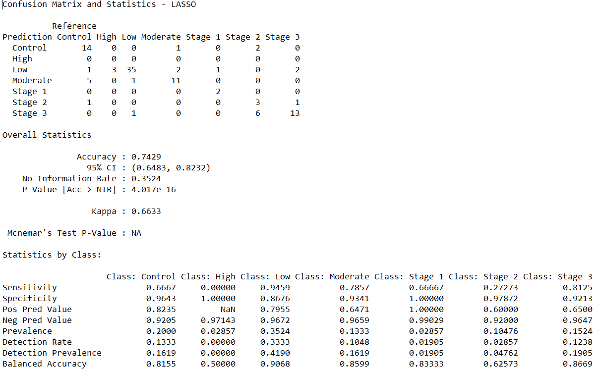

```{r eval=FALSE}
#plots
plot(lasso.cv)
plot(lasso)
```

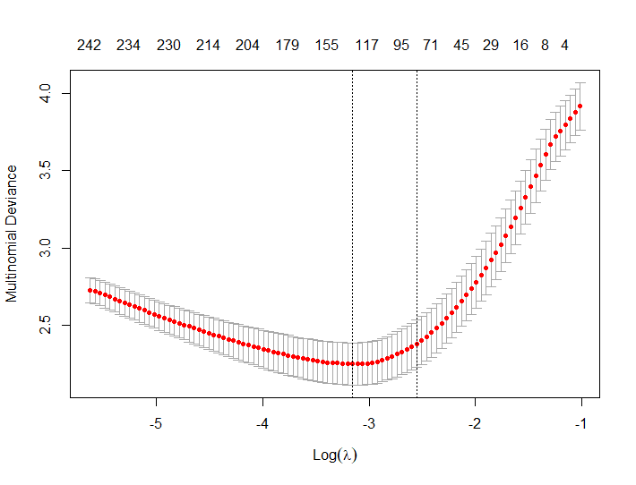  
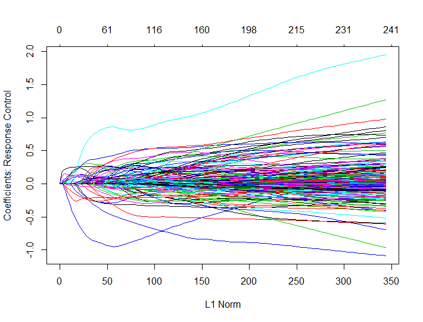 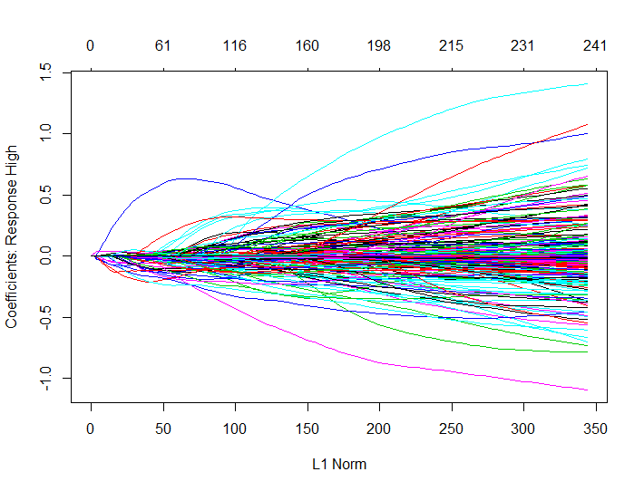 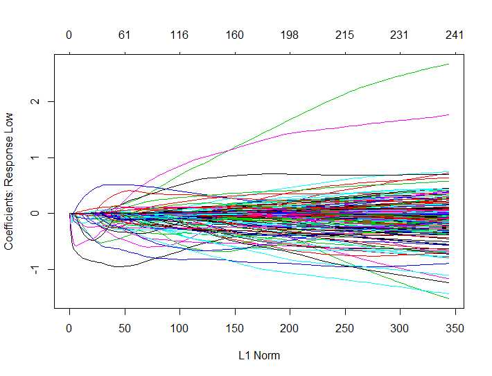 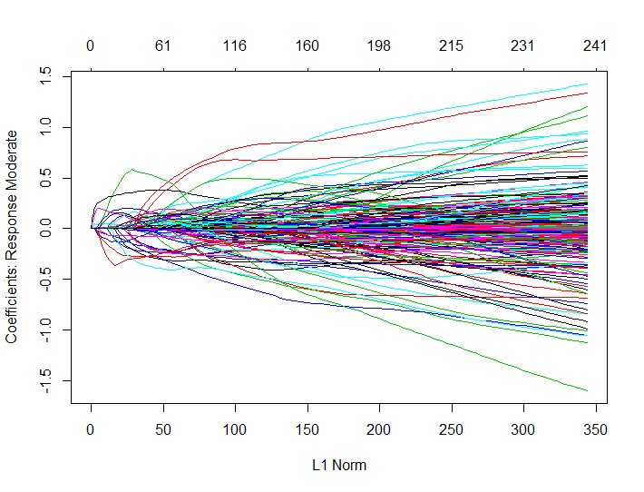 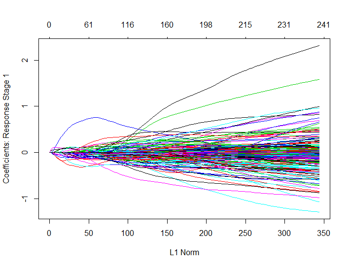 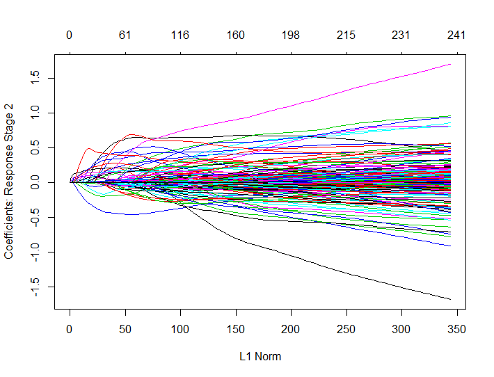
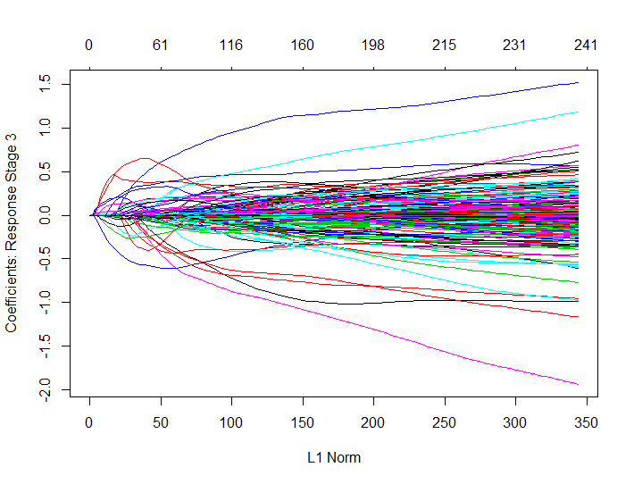
